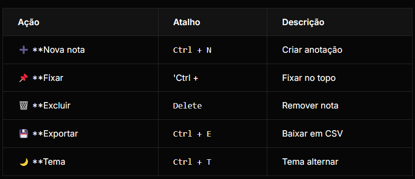

# Dev Notes

   

**Aplicação para Devs criarem anotações de trabalho.** Sistema **persistente** com **localStorage**, permite **criar**, **fixar**, **excluir** anotações. **Exporta em CSV** para backup e **tema claro/escuro** customizável.

## ✨ **Demo**

[🔗 Teste as Dev Notes](https://seu-dev-notes.netlify.app) *(substitua pelo link do seu deploy)*

## 📱 **Funcionalidades**

- ✅ **Criar anotações** instantaneamente
- ✅ **Fixar notas** importantes (pin)
- ✅ **Excluir** individualmente ou em massa
- ✅ **Persistência** localStorage automática
- ✅ **Exportar CSV** (backup completo)
- ✅ **Tema claro/escuro** (auto-detecta)
- ✅ **Busca rápida** por texto
- ✅ **Drag & Drop** reordenação
- ✅ **Contador** de notas ativas/fixadas

## 🎯 **Para quem é?**
 - 👨 💻 Desenvolvedores
 - 👩 💻 DevOps
 - 👨 🔬 QA/Testadores
 - 📱 Desenvolvedores móveis
 -  🎨 Designers


## 🛠️ **Tecnologias**

```javascript
- Vanilla JavaScript ES6+
- localStorage API
- CSV Export (Blob/Download)
- CSS Custom Properties (Themes)
- Drag & Drop API
- Service Worker (PWA opcional)
```

## 📂 Estrutura
```
dev-notes/
│
├── index.html
├── style.css
├── script.js
├── icons/
│   └── (pinned, trash, export)
└── README.md
```

## 🚀 Instalação

```
# Clone ou baixe
git clone https://github.com/seuusuario/dev-notes.git

# Abra index.html
# Funciona 100% OFFLINE! 🚀
```

## 🎮 Como usar

<br><br>

## 🎨 Capturas de tela

| Tema Claro | Tema Escuro | Fixadas + Export |
| ------------- | ------ | ---------- |
|  |  |  |

## 💾 Forma

```
id,titulo,conteudo,dataCriacao,fixada
1,"Bug API","Erro 500 na rota /users",2024-01-15,true
2,"Feature Nova","Implementar dark mode",2024-01-14,false
```

## 🌙 Sistema de Temas

```
:root {
  --bg-primary: #ffffff;
  --text-primary: #1a1a1a;
}

[data-theme="dark"] {
  --bg-primary: #1a1a1a;
  --text-primary: #ffffff;
}
```

## 🔧 Ganchos Personalizados

```
// Principais funções
createNote()
pinNote(id)
deleteNote(id)
exportToCSV()
toggleTheme()
searchNotes(query)
```

## ♿ Acessibilidade

- ✅ **ARIA labels** completos
- ✅ **Navegação teclado (atalhos)**
- ✅ **Temas de alto contraste**
= ✅ **Amigável para leitores de tela**
- ✅ **Gestão de foco**

## 📱 PWA Ready (Opcional)

- ✅ Offline primeiro
- ✅ Installable
= ✅ Background sync
- ✅ Push notifications

## 🎨 Personalização

```
1. Cores: CSS Variables
2. Ícones: SVG personalizados
3. Shortcuts: Configurar teclas
4. Auto-backup: Google Drive
5. Tags: Categorizar notas
```

## 🤝 Contribuindo

```
1. Fork → Clone
2. `npm install` (se usar modules)
3. Branch `feat/sua-ideia`
4. Teste → Commit → PR
```

## 📄 Licença
MIT - Use em seus projetos!

## 🙋‍♂️ Autor
**`Portfólio de Desenvolvedor Fullstack`**<br><br>
[ParreirasJuniorWeb](https://github.com/ParreirasJuniorWeb)<br>
✉️ [joaoparreiras2020@gmail.com](mailto:joaoparreiras2020@gmail.com)<br>
💼 [jvparreiras](https://linkedin.com/in/jvparreiras)<br>

<div align="center">
  <br><br>
  Suas anotações de dev sempre organizadas e persistentes! 💻✨
</div> 
